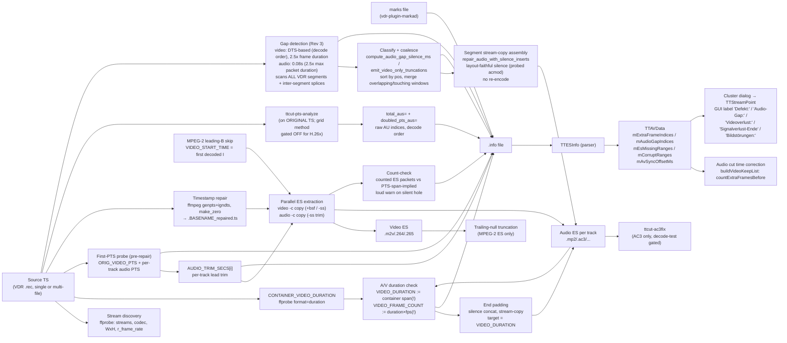

# ttcut-demux — TS→ES demux pipeline and its measurement/reporting chain

Bash script (`tools/ttcut-demux/ttcut-demux`, installed copy at
`/usr/bin/ttcut-demux` — the user copies it there after patches). The ES
demux is the only mode since the normalized-MKV mode (a leftover of the
v0.52 initial import, requiring mkvmerge) was removed in `ce06817`; `-e` is
accepted as a no-op for compatibility.

Mapped 2026-07-12 while root-causing the reporting defects found in the
Futurama audit (wrong "video duration", derived frame count, "defective
regions" mislabel) — the measurement edges carry the exact semantics needed
for that fix.

Legend: solid = data flow, dashed = trigger/control.

```mermaid
flowchart LR
    TS["Source TS<br/>(VDR .rec, single or multi-file)"]
    MARKS["marks file<br/>(vdr-plugin-markad)"]
    PROBE["Stream discovery<br/>ffprobe: streams, codec, WxH, r_frame_rate"]
    CONTDUR["CONTAINER_VIDEO_DURATION<br/>ffprobe format=duration"]
    PTS0["First-PTS probe (pre-repair)<br/>ORIG_VIDEO_PTS + per-track audio PTS"]
    TRIM["AUDIO_TRIM_SECS[i]<br/>per-track lead trim"]
    REPAIR["Timestamp repair<br/>ffmpeg genpts+igndts, make_zero<br/>→ .BASENAME_repaired.ts"]
    EXTRACT["Parallel ES extraction<br/>video -c copy (+bsf / -ss)<br/>audio -c copy (-ss trim)"]
    MPEG2TRIM["MPEG-2 leading-B skip<br/>VIDEO_START_TIME = first decoded I"]
    NULLTRUNC["Trailing-null truncation<br/>(MPEG-2 ES only)"]
    ESV["Video ES<br/>.m2v/.264/.265"]
    ESA["Audio ES per track<br/>.mp2/.ac3/..."]
    PTSA["ttcut-pts-analyze<br/>(on ORIGINAL TS; grid method<br/>gated OFF for H.26x)"]
    EXTRA["total_aus= + doubled_pts_aus=<br/>raw AU indices, decode order"]
    AC3FIX["ttcut-ac3fix<br/>(AC3 only, decode-test gated)"]
    GAPS["Gap detection (Rev 3)<br/>video: DTS-based (decode order), 2.5x frame duration<br/>audio: 0.08s (2.5x max packet duration)<br/>scans ALL VDR segments + inter-segment splices"]
    CLASSIFY["Classify + coalesce<br/>compute_audio_gap_silence_ms /<br/>emit_video_only_truncations<br/>sort by pos, merge overlapping/touching windows"]
    ASSEMBLY["Segment stream-copy assembly<br/>repair_audio_with_silence_inserts<br/>layout-faithful silence (probed acmod)<br/>no re-encode"]
    COUNTCHECK["Count-check<br/>counted ES packets vs PTS-span-implied<br/>loud warn on silent hole"]
    DURCHK["A/V duration check<br/>VIDEO_DURATION := container span(!)<br/>VIDEO_FRAME_COUNT := duration×fps(!)"]
    PAD["End padding<br/>silence concat, stream-copy<br/>target = VIDEO_DURATION"]
    INFO[".info file"]
    ESINFO["TTESInfo (parser)"]
    AVDATA["TTAVData<br/>mExtraFrameIndices / mAudioGapIndices<br/>mEsMissingRanges / mCorruptRanges<br/>mAvSyncOffsetMs"]
    AUDIOCORR["Audio cut time correction<br/>buildVideoKeepList: countExtraFramesBefore"]
    STREAMPTS["Cluster dialog → TTStreamPoint<br/>GUI label 'Defekt:' / 'Audio-Gap:' /<br/>'Videoverlust:' / 'Signalverlust-Ende' / 'Bildstörungen:'"]

    TS --> PROBE
    TS --> CONTDUR
    TS --> PTS0
    PTS0 --> TRIM
    TS --> REPAIR
    REPAIR --> EXTRACT
    MPEG2TRIM --> EXTRACT
    TRIM --> EXTRACT
    EXTRACT --> ESV
    EXTRACT --> ESA
    ESV --> NULLTRUNC
    EXTRACT --> COUNTCHECK
    TS --> PTSA
    PTSA --> EXTRA
    ESA --> AC3FIX
    TS --> GAPS
    GAPS --> CLASSIFY
    CLASSIFY --> ASSEMBLY
    ASSEMBLY --> ESA
    CONTDUR --> DURCHK
    ESA --> DURCHK
    DURCHK --> PAD
    PAD --> ESA
    EXTRA --> INFO
    GAPS --> INFO
    CLASSIFY --> INFO
    COUNTCHECK --> INFO
    TRIM --> INFO
    PTS0 --> INFO
    DURCHK --> INFO
    MARKS --> INFO
    INFO --> ESINFO
    ESINFO --> AVDATA
    AVDATA --> AUDIOCORR
    AVDATA --> STREAMPTS
```

## Edge semantics

| From → To | Data / order / invariant carried |
|---|---|
| TS → CONTAINER_VIDEO_DURATION | `ffprobe format=duration` of the source = **container span** (latest stream end − earliest stream start). With audio leading video (typical VDR), this exceeds the video display duration by the audio lead. Since `d7a046b` used only as a **seek hint** for the end-window probe, no longer as the duration. |
| VIDEO_DURATION = video PTS span (FIXED `d7a046b`) | Measured on the repaired TS: `last_video_pts + frame_dur − first_video_pts`, where `first_video_pts` = the video stream's **start_time** (first *decodable* frame — excludes open-GOP leading Bs, which every decoder drops and which the old min-packet-PTS wrongly included). Falls back to the container span (with a warning) only if the repair failed or the probe is empty. Futurama: 3419800 ms = 85495 frames, exact vs ffprobe count_frames (was container 3420269). |
| VIDEO_DURATION → `VIDEO_FRAME_COUNT` | `duration × fps`, rounded — derived, logged with a `~` prefix. Now exact (85495) because the duration is the true video span. |
| VIDEO_DURATION → end padding | `TARGET_AUDIO_DUR = VIDEO_DURATION` when `AV_DRIFT_MS > 20`. Pads to the true video duration → over-pad reduced from ~469 ms (old container basis) to ~one audio-frame granularity (Futurama: +960 ms for a 939 ms real gap). Post-pad drift now computed against the real reference. |
| PTS0 → per-track trim | Per audio track: `video_pts − track_pts`, trimmed via decoder-side `-ss` **after** `-i` (input-side seek silently no-ops for TS audio copy). Only positive leads > 10 ms trim; negative logs "may need padding" and trims 0. |
| PTS0 (video) semantics | H.264/H.265: min packet PTS of first 2 s = **first display frame** (leading Bs). MPEG-2: **first packet PTS = the I-frame**, NOT the display start — bitstream-leading open-GOP Bs display up to (M−1)/fps earlier. Audio is therefore aligned to the I's display time, while TTCut's index 0 is the leading B (the "ffmpeg-n = display − 3" ruler, see `mpeg2-cut.md`). |
| MPEG-2 leading-B skip → extraction | Fires only when the **first decoded** frame is not I (ffprobe frame list = decoder output; broken leading Bs the decoder drops are invisible to this check). When it fires: video `-ss FIRST_I_PTS` + all audio trims += `VIDEO_START_TIME`. Futurama: did not fire (first decoded = I), bitstream-leading Bs stay in the ES. |
| TS → ttcut-pts-analyze | Runs on the **original** TS (pre-repair), own mmap TS parser, video PID only. Exit 0 = clean, 1 = candidates found, 2 = error. **Measured 2026-07-19: analyzing the repaired TS instead is WRONG** — the repair remux erases the MPEG-2 doubled-PTS signature (00x03: 150→0) and genpts re-stamping fabricates candidates on PAFF fields (08x04: 0→247). Original stays the analysis source; TTCut guards the numbering (see below). Capture in the demux is stdout-only; stderr goes to a temp log (the old `2>&1` raced the unbuffered stderr summary into the block-buffered CSV and truncated it — 731 of 1296 entries + garbage suffix). |
| ttcut-pts-analyze → `total_aus=` / `doubled_pts_aus=` | **Raw AU indices in decode/bitstream order** (one AU per PES packet, PAFF fields separate; `total_aus` always printed, candidates only on exit 1). Detection: (1) DTS non-monotonic (≤1 s backward; >1 s = epoch reset, ignored), (2) exact PTS duplicate in 16-AU window, (3) **PTS grid** (runs of half-nominal spacing → off-grid AUs) — **method 3 is SKIPPED for H.264/H.265** (PMT stream_type gate): field-rate PTS is legitimate there and the grid signature cannot distinguish it from corruption (08x04 mixed MBAFF+PAFF: 1296 grid hits, zero real defects; full-PAFF streams dodge only because the field cadence dominates the gap statistics). MPEG-2 keeps all three methods. |
| script → warn (neutral since `f85b237`) | "N pictures with doubled PTS detected (field-picture pairs or TS corruption)" — no longer a "defective regions" verdict. The count/list itself is unchanged. |
| TS → gap detection (Rev 3, replaces the old ≥5s/≥1s thresholds) | Frame-scale thresholds, not fixed seconds: video `2.5 × nominal frame duration` (`detect_video_gaps`, DTS-based — **decode order**, not PTS, because PTS is non-monotonic under B-frame reorder and produced ~977 false positives at a 0.05 s threshold on clean material during Task 2; reported gap boundaries stay in the PTS domain so overlap math against audio stays comparable); audio `0.08 s` (2.5 × the larger of MP2@48k 24 ms / AC3 32 ms). Both scan **every** VDR segment (`detect_video_gaps_multifile` / `detect_audio_gaps_multifile`), not just the first — a real 5-segment signal-loss recording had ~25 s of within-segment holes invisible to a single-segment scan — and additionally emit the inter-segment **splice gap** (concat demuxer re-bases segment i+1 to start exactly where i ended, silently discarding real broadcast time between them; reported the same way as a within-segment hole). DTS-order measurement has a small upward bias (a few frame durations) from B-frame reorder lag. |
| gap detection → classify (`compute_audio_gap_silence_ms` / `emit_video_only_truncations`) | Per audio gap: `silence_ms = max(0, audio_gap_ms − Σ overlapping video-gap ms)` — combined A+V loss inserts only the audio-minus-video remainder (often a small residual like 256 ms), pure audio-only loss inserts the full gap. Per video gap not fully covered by an audio gap: emits a **truncate row** (`silence_ms` negative) removing the audio-only surplus so the track doesn't run ahead. Rows accumulate into one 4-field `CLASSIFIED_FILE` per track (`src_start src_end gap_ms silence_ms`), sorted by source position. |
| classify → coalesce (inside `repair_audio_with_silence_inserts`) | Dense micro-gap clusters can produce overlapping or exactly-touching local edit windows (measured: a ~13.7 ms non-monotonic `pos` regression, and two back-to-back inserts collapsing to the identical `pos`) — both crash `ffmpeg -ss/-to` with "-to value smaller than -ss" if left unmerged. Fix: re-sort the local (`pos`,`dur`) pairs ascending (source-row order does not guarantee ascending `pos` once truncation and silence rows interleave), then sweep-merge any entry whose `pos` falls **at or inside** (`<=`, not `<`) the running window end, summing signed durations; near-zero merged results (< 1 ms) are dropped. This only regroups *local* assembly bookkeeping — it never changes a `pos`/`dur` value already computed from the source `CLASSIFIED_FILE` row. |
| coalesce → assembly (`repair_audio_with_silence_inserts`) | Segment **stream-copy** (no re-encode of surviving content): the track is cut into `[prev_end, pos)` copies at every coalesced gap, interleaved with trimmed slices of a single 40 s silence master (encoded once per parameter set, capped with a warning past 40 s) or with a truncation (negative `dur` just advances `prev_end`, dropping that span). All segments are concatenated via ffmpeg's concat demuxer using **basename-only** paths in the list file (list lives in `work_dir`, and the demuxer resolves relative paths against the list file's own directory — a `work_dir`-prefixed entry gets `work_dir` prepended twice). Silence uses the **probed channel layout** (`probe_audio_props` → e.g. `3.0`, `5.1(side)`), not a bare channel count — ffmpeg's default layout for a count doesn't always match the source AC3 acmod (3ch defaults to 2.1, not 3.0/surround). On any ffmpeg step failure the original audio file is left untouched (return non-zero, caller warns). |
| assembly → per-track `.info` balance | Sum of the classified file's signed 4th column (positive = inserted silence, negative = removed/truncated) → `audio_${i}_silence_ms` / `audio_${i}_removed_ms`. |
| gap detection (video) → `es_missing_frames` / `es_missing_ranges` | Each `VIDEO_GAPS_FILE` row mapped to **output-ES frame coordinates**: `fs = ((vs − FIRST_VIDEO_PTS) − lost_before) × fps`, where `lost_before` accumulates prior holes' durations (the output ES physically lacks those frames, so everything after a hole shifts earlier). `es_missing_frames` stays the raw, unclustered per-hole `fs` list (informational). `es_missing_ranges` clusters those `fs` positions (same `≤2s`/`2×fps` rule as `corrupt_frame_ranges`, sorted first) into `fs-fe:ms` zones — `fe` is the last cluster member's `fs+1` (the degenerate single-frame span for an isolated hole), `ms` is the sum of member `ms` values with each first clamped to `≥0` (a negative raw `ms` is a DTS/PTS boundary artifact, not real silence). Before this rule every raw hole emitted its own point-range (measured: dozens to hundreds on real signal-loss material, including negative-`ms` and duplicate-position entries). |
| video demux log → `corrupt_frame_ranges` | ffmpeg's "Packet corrupt" DTS ticks (captured during extraction, before ffmpeg's own wrap-correction) are wrap-corrected per tick (`+= 2^33` until non-negative relative to `FIRST_VIDEO_PTS`'s own tick — a raw 33-bit/90kHz PES field, unrelated to `FIRST_VIDEO_PTS`'s wrap-relative value; a real recording had ffmpeg log post-wrap ticks that, subtracted naively, went massively negative and were silently dropped by an `f < 0` filter, losing 69 real corrupt-packet lines), converted to a frame number, and sanity-bounded to `[0, VIDEO_FRAME_COUNT]` — **before** sorting. A tick from a different PTS "era" (VDR re-acquiring signal after a full outage resets the broadcaster's 33-bit counter) can survive the wrap correction as an absurd frame number; sorting raw ticks before wrap-correcting them (the old order) also scrambled chronological order, producing inverted `start>end` ranges. Only after wrap-correct → bound-check → sort does the ≤2s clustering pass run; the emitted range is additionally checked for `start<=end` as a second line of defense. No duration is implied (frames are present, just flagged) — `TTESRange.ms == -1` for these. |
| extraction → count-check (loud warn) | Independent second signal that does not depend on gap detection: `ffprobe -count_packets` on the output ES vs. `EXPECTED_FRAMES = (VIDEO_DURATION_MS/1000) × fps`; a difference > 1 frame warns "Video ES is missing N frames mid-stream ... audio was adjusted, check the defect markers". Catches a **silent** hole (dropped packets with no PTS discontinuity signature, e.g. right after a damaged GOP) that gap detection alone would miss. ffprobe's raw-`.m2v` CSV writer appends a trailing comma to `nb_read_packets` (a demuxer quirk, not a frame/packet distinction) which silently failed bash's integer test — the check was a no-op for every MPEG-2 run until the trailing comma was stripped. |
| .info `[timing]` → TTESInfo | Parsed: `first_video_pts`, `first_audio_pts`, `av_offset_ms` (→ `mAvSyncOffsetMs`, applied in the cut path). **NOT parsed: `video_duration_ms`, `audio_duration_ms`, `duration_drift_ms`, `drift_rate_ms_per_min`** — human-only diagnostics; fixing them changes no app behavior. |
| .info `[audio]` → TTESInfo | Per track: `file/codec/lang/first_pts/trimmed_ms` → per-track delay handling (`TTAudioItem`). |
| .info `es_total_aus`/`es_doubled_pts_aus` → TTAVData (contract 2026-07-19; legacy `es_extra_frames` no longer parsed) | The audio-correction source is chosen by `loadExtraFrameIndices`: for **MPEG-2 the parser's field-pair list wins** (`extraIndices()`, display-index space, `picture_structure`-derived), .info only as fallback. **H.26x: candidates are raw-AU-numbered and classified through the PAFF raw→merged map** (`TTFFmpegWrapper::mergePAFFFieldsInIndex` records it; `TTH26xVideoStream::rawAuCount/mapRawAuToDisplayIndex/rawAuIsCollapsedField`): guard `es_total_aus == rawAuCount()` (mismatch → discard + warn), collapsed second fields → legitimate pairs (dropped), no display slot (dropped leading pics) → skipped + warn, survivors → display-space `mExtraFrameIndices`. **Timing:** both the source choice and the cluster dialog run in `onOpenVideoFinished` (not `openAVStreams`), because the parser/frame index is only built once the async open task finishes. A per-item flag `mpPendingExtraFrameDialog` (set only on fresh open) gates the dialog so project reload stays silent. `showExtraFrameClusterDialog`: MPEG-2 clusters the raw .info list and confirms via parser field-pairs within ±4; H.26x clusters the already-classified `mExtraFrameIndices` (everything remaining is a real defect). **Only UNCONFIRMED clusters become a visible `"Defekt:"` stream point** — parser-confirmed field pairs are normal interlaced-encoder output and are counted for the log only, never marked on the timeline (`34c80890`, 2026-07-19: they used to be added as Error points and cluttered the timeline of every interlaced MPEG-2 recording). The internal audio correction is unaffected: it reads the parser positions via `loadExtraFrameIndices`, independent of these markers. Empty list → no dialog. |
| .info `audio_gap_frames` → TTAVData | → `mAudioGapIndices`, marker visualization only ("Audio-Gap:"), NOT used for audio time correction. Emitted as frame indices relative to `first_video_pts` (`(gap_pts − first_video_pts) × fps`). |
| .info `es_missing_ranges` / `corrupt_frame_ranges` → TTAVData → STREAMPTS | Parsed by `TTESInfo` into `mEsMissingRanges` / `mCorruptRanges` (`TTESRange`, `avstream/ttesinfo.h`), consumed by `TTAVData`'s cluster pass 3 (`data/ttavdata.cpp`) alongside the extra-frame and audio-gap passes. Ranges arrive **pre-clustered** from the demuxer for both fields (`es_missing_ranges` and `corrupt_frame_ranges` both merge raw entries `≤2s`/`2×fps` frames apart, same rule) — TTAVData only emits the marker text, it does not re-cluster. Each `es_missing_ranges` entry emits `"Videoverlust: X–Y (T s) — Audio angepasst"`; a hole `> 2 s` additionally emits a second marker at the range end, `"Signalverlust-Ende (≈T s fehlen)"`, so long outages get a distinct end-of-loss landing zone rather than only a start marker. Each `corrupt_frame_ranges` entry emits `"Bildstörungen: X–Y"` (no duration — `ms == -1`). |
| .info `[markers]` → TTESInfo | Verbatim copy of the VDR marks file (timestamp, frame, start/stop, `*` verified). Faithful (audited 2026-07-12). |

## Assumptions, contracts & pitfalls

- **`VIDEO_DURATION` is a container span, not a video duration.** ffprobe
  `format=duration` = latest end − earliest start across ALL streams; DVB
  audio typically starts ~0.5 s before video. Everything derived from it
  (frame count, drift, padding target, `.info` duration fields) inherits the
  inflation. Correct references: video-stream PTS span (last video PTS + one
  frame − first video **display** PTS) or a real frame count.
- **Two different "first video PTS" per codec family** (see edge table). For
  MPEG-2 the audio alignment target is the I-frame's display time; TTCut's
  display index 0 is the earlier leading B. Any oracle comparing ffmpeg
  output indices with TTCut indices must correct for the dropped leading Bs
  (`mpeg2-cut.md` pitfall, "ffmpeg-n = TTCut-display − 3" on Futurama).
- **pts-analyze indices are raw decode-order AU positions** (one per PES
  packet — PAFF fields count separately!). For MPEG-2, TTAVData consumes them
  as index-list positions (display order); the two spaces differ locally by
  the B-reorder distance (≤ M−1), immaterial for the counting-before audio
  correction except within a pair cluster. **For H.26x the raw space differs
  from TTCut's merged frame index by the cumulative field-pair count** (08x04:
  89800 raw vs 88504 merged, drift up to ~29 s of audio timing) — hence the
  raw→merged map + `es_total_aus` guard on the TTCut side (2026-07-19).
- **Method-3 grid detection cannot distinguish corruption from field
  encoding.** Runs of half-duration PTS spacing are the signature of BOTH.
  For H.26x the method is therefore gated OFF at the source (PMT
  stream_type); for MPEG-2 the list stays as-is and TTCut's parser
  confirmation supplies the field-pair/defect distinction.
- **Padding granularity**: end padding appends whole encoded silence frames
  via concat stream-copy (bit-preserving for AC3 acmod changes). Mid-stream
  gap repair (Rev 3, `repair_audio_with_silence_inserts`) is **also**
  segment stream-copy now, not the old filter_complex re-encode — both
  mechanisms are stream-copy, but stay two separate implementations (end
  padding appends one silence block against a fixed target; mid-stream
  repair splices N silence/truncate segments at arbitrary interior
  positions) — do not "unify" them.
- **`-ss` placement contract**: audio trim must be decoder-side (`-ss` after
  `-i`); input-side seek silently produces an untrimmed copy for TS audio.
- **Repair step**: `+genpts+igndts -avoid_negative_ts make_zero` normalizes
  to ~0 and passes through PES-corruption warnings (e.g. VDR stop mid-PES at
  recording end — benign, faithfully reported).
- **exit-code contract with the wrapper script**: pts-analyze exit 1 is
  "extras found" (not an error); the demux script must `set +e` around it.
- **Video gap detection is DTS-based, not PTS-based** (Rev 3, reviewer-
  confirmed necessary in Task 2). PTS is not monotonic in decode order once
  B-frames reorder the display sequence — a fixed PTS threshold produced 977
  false positives on clean material at 0.05 s. DTS is monotonic in a healthy
  stream, so a DTS jump is the correct corruption signal; reported gap
  boundaries stay in the PTS domain for overlap math against audio gaps.
- **VDR multi-file gap scanning must cover every segment, not just the
  first.** `ORIGINAL_INPUT` is only `00001.ts`; a naive single-file scan is
  blind to content loss inside segments 2..N (measured: ~25 s of
  within-segment holes on segment 3 of a real 5-segment recording) and to
  the splice gap the concat demuxer silently swallows between segments.
- **Overlapping/touching local repair windows must be coalesced before
  assembly**, or `ffmpeg -ss/-to` aborts with "-to value smaller than -ss"
  and the whole track falls back to unrepaired audio. Dense micro-gap
  clusters (signal degrading gradually before a full outage) are the
  trigger; the merge sweep needs the local `(pos, dur)` pairs sorted
  ascending first — source-row order (by `src_start`) does **not** guarantee
  ascending `pos` once video-only-truncation rows interleave with
  audio-gap rows (measured ~13.7 ms regression on real data) — and must
  treat exactly-touching windows (`<=`) the same as overlapping ones, or a
  zero-width segment triggers the identical ffmpeg abort.
- **The count-check is a distinct, gap-detection-independent signal.** It
  compares counted output-ES packets against what the PTS-span duration
  implies, catching a silent hole (dropped packets with no PTS
  discontinuity) that neither the DTS-jump nor the multi-file scan would
  see. It was a silent no-op for every MPEG-2 run until fixed (ffprobe's
  raw-`.m2v` CSV writer appends a trailing comma to `nb_read_packets`,
  which fails bash's `-eq` integer test silently under `2>/dev/null`).
- **`corrupt_frame_ranges`' DTS ticks need explicit 2^33 wrap correction**
  against `FIRST_VIDEO_PTS`'s own tick before converting to frame numbers —
  they are logged by ffmpeg's demuxer *before* its own wrap-correction runs.
  Skipping this silently drops every corrupt-packet line logged after the
  recording's tick counter has wrapped relative to `FIRST_VIDEO_PTS`
  (measured: 69 real corrupt-packet lines lost on a real recording where
  `first_video_pts` sat close to the wrap boundary).

## Redundancy / consolidation candidates — ALL RESOLVED 2026-07-12

1. **[RESOLVED `ce06817`]** Subtitle extraction block was duplicated between
   ES mode and MKV mode — gone with the MKV-mode removal (one copy left).
2. **[RESOLVED `ce06817`]** `LANG_COUNT` audio naming was duplicated — gone
   with the MKV-mode removal.
3. **[RESOLVED `ce6377c`]** First-video-PTS probe → `probe_first_video_pts`,
   measured once pre-repair; the sync-offset section reuses the value.
4. **[RESOLVED `2edd772`]** Audio property probing → `probe_audio_props`
   (APROBE_* globals, validation + codec bitrate defaults); each call site
   keeps its own fallback application, the two padding mechanisms stay
   separate (see pitfall above).
5. **[RESOLVED `2e0cd62`]** ffmpeg log-grep pattern → readonly
   `FFMPEG_WARN_PATTERN` + `warn_ffmpeg_log` (superset pattern; may surface
   a few more log lines than before — log-only change).

Verified after all five: Futurama ES outputs byte-identical to the
pre-refactor baseline (video, both audio tracks, logo, .info modulo
timestamp/basename); a no-`-e` invocation produces the identical ES set.

## Reporting defects — FIXED 2026-07-12

- **Duration/frame-count/drift/padding chain** (`f85b237` + `d7a046b`):
  `VIDEO_DURATION` is now the video PTS span (start_time to last PTS + one
  frame), not the container span. Frame count, padding target and drift are
  derived correctly; verified on Futurama (3419800 ms = 85495 frames, exact).
- **Warning wording** (`f85b237`): grid-method hits are labelled "N pictures
  with doubled PTS (field-picture pairs or TS corruption)".
- **GUI "Defekt:" mislabel** (`fc2a573`): the cluster dialog now confirms
  field pairs against the MPEG-2 parser and labels them "Feldpaare:"; the
  classification runs in `onOpenVideoFinished` where the parser list exists.
  All-confirmed field-pair sets import silently (no dialog).

Still open (separate): field-picture material double-counts index positions
(fields vs frames) in the video cut path — see `mpeg2-cut.md` Defekt 2.

## Defect detection and repair — Rev 3 (2026-07-18)

Replaces the earlier fixed-threshold (audio ≥5s / video ≥1s) gap machinery
described above with a frame-scale, all-segment scan and adds actual repair
(not just detection) plus mid-stream loss/corruption reporting. Motivation:
TS-packet corruption and VDR signal-loss segment boundaries were previously
either invisible (fixed thresholds too coarse, single-segment scan) or
detected-but-unrepaired.

- **Detection**: `detect_video_gaps`/`detect_video_gaps_multifile` (DTS-based,
  decode order, 2.5× frame duration) and `detect_audio_gaps`/
  `detect_audio_gaps_multifile` (0.08 s) scan every VDR segment plus
  inter-segment splices — see the edge-table rows and pitfalls above for the
  DTS-vs-PTS and multi-file rationale.
- **Repair**: `compute_audio_gap_silence_ms` / `emit_video_only_truncations`
  classify each hole (audio-own gap → codec-native, layout-faithful silence
  insert; video-only gap → matching audio truncation) into a per-track
  `CLASSIFIED_FILE`; `repair_audio_with_silence_inserts` sorts and coalesces
  overlapping/touching windows, then assembles the repaired track via
  segment stream-copy (no re-encode of surviving audio).
- **Reporting**: new `.info` fields `es_missing_frames` / `es_missing_ranges`
  (video holes, output-ES frame coordinates), `corrupt_frame_ranges` (frames
  present but flagged corrupt, wrap-corrected DTS-tick clustering),
  `audio_${i}_silence_ms` / `audio_${i}_removed_ms` (per-track repair
  balance), plus the independent count-check warn for silent (no-PTS-jump)
  holes.
- **TTCut GUI**: `TTAVData`'s cluster pass 3 turns `es_missing_ranges` /
  `corrupt_frame_ranges` into clustered error landing zones — see the
  `.info es_missing_ranges / corrupt_frame_ranges → TTAVData → STREAMPTS`
  edge-table row for the exact marker text and the >2s
  "Signalverlust-Ende" double-marker rule.
- **Gates (measured this cycle, `docs/superpowers/sdd/progress.md`,
  Task 7)**: 07x11 (real, mild damage) — 0 failed repairs, 39/39 silence
  inserts applied, drift −92 ms → the fixture's bound is `holes × 32 ms` =
  1312 ms (PASS). 07x12 (real, 5 VDR segments, ≈7.6 min combined signal
  loss) — 0 failed repairs, 496/496 applied, drift **−35 040 ms → −23 ms**,
  all 4 segment-boundary large-loss ranges present in `es_missing_ranges`.
  Clean (undamaged) recordings verified byte-identical to the pre-Rev-3
  output for both codec families.
- **Known gap** (pre-existing, not new): mid-stream loss/corruption markers
  are populated regardless of interactivity; the fresh-open extra-frame
  cluster dialog itself (`showExtraFrameClusterDialog`, unrelated code path)
  still calls `msgBox.exec()` without an `mNonInteractive` guard — does not
  affect `--auto-cut` (project load bypasses `openAVStreams`), but blocks a
  headless fresh-open. Tracked in `TODO.md`.
