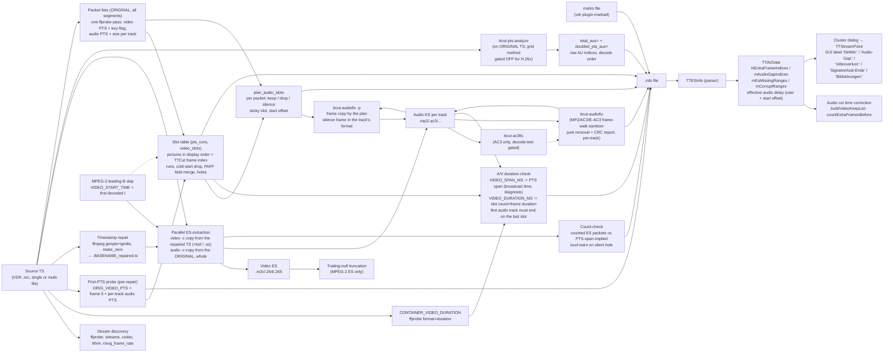

# ttcut-demux — TS→ES demux pipeline and its measurement/reporting chain

Bash script (`tools/ttcut-demux/ttcut-demux`, installed copy at
`/usr/bin/ttcut-demux` — the user copies it there after patches).`-e` is
accepted as a no-op for compatibility.

Mapped 2026-07-12 while root-causing the reporting defects found in the
Futurama audit (wrong "video duration", derived frame count, "defective
regions" mislabel) — the measurement edges carry the exact semantics needed
for that fix.

Legend: solid = data flow, dashed = trigger/control.

```mermaid
flowchart LR
    TS["Source TS<br/>(VDR .rec, single or multi-file)"]
    MARKS["marks file<br/>(vdr-plugin-markad)"]
    PROBE["Stream discovery<br/>ffprobe: streams, codec, WxH, r/avg_frame_rate"]
    CONTDUR["CONTAINER_VIDEO_DURATION<br/>ffprobe format=duration"]
    PTS0["First-PTS probe (pre-repair)<br/>ORIG_VIDEO_PTS = frame 0 + per-track audio PTS"]
    REPAIR["Timestamp repair<br/>ffmpeg genpts+igndts, make_zero<br/>→ .BASENAME_repaired.ts"]
    EXTRACT["Parallel ES extraction<br/>video -c copy from the repaired TS (+bsf / -ss)<br/>audio -c copy from the ORIGINAL, whole"]
    MPEG2TRIM["MPEG-2 leading-B skip<br/>VIDEO_START_TIME = first decoded I"]
    NULLTRUNC["Trailing-null truncation<br/>(MPEG-2 ES only)"]
    ESV["Video ES<br/>.m2v/.264/.265"]
    ESA["Audio ES per track<br/>.mp2/.ac3/..."]
    PTSA["ttcut-pts-analyze<br/>(on ORIGINAL TS; grid method<br/>gated OFF for H.26x)"]
    EXTRA["total_aus= + doubled_pts_aus=<br/>raw AU indices, decode order"]
    AC3FIX["ttcut-ac3fix<br/>(AC3 only, decode-test gated)"]
    AUDIOFIX["ttcut-audiofix<br/>(MP2/AC3/E-AC3 frame-walk sanitizer<br/>junk removal + CRC report, per-track)"]
    PKTS["Packet lists (ORIGINAL, all segments)<br/>one ffprobe pass: video PTS + key flag,<br/>audio PTS + size per track"]
    SLOTS["Slot table (pts_runs, video_slots)<br/>pictures in display order = TTCut frame index<br/>runs, cold-start drop, PAFF field merge, holes"]
    PLAN["plan_audio_slots<br/>per packet: keep / drop / silence<br/>sticky slot, start offset"]
    ASSEMBLE["ttcut-audiofix -p<br/>frame copy by the plan<br/>silence frame in the track's format"]
    COUNTCHECK["Count-check<br/>counted ES packets vs PTS-span-implied<br/>loud warn on silent hole"]
    DURCHK["A/V duration check<br/>VIDEO_SPAN_MS := PTS span (broadcast time, diagnosis)<br/>VIDEO_DURATION_MS := slot count×frame duration<br/>first audio track must end on the last slot"]
    INFO[".info file"]
    ESINFO["TTESInfo (parser)"]
    AVDATA["TTAVData<br/>mExtraFrameIndices / mAudioGapIndices<br/>mEsMissingRanges / mCorruptRanges<br/>effective audio delay (user + start offset)"]
    AUDIOCORR["Audio cut time correction<br/>buildVideoKeepList: countExtraFramesBefore"]
    STREAMPTS["Cluster dialog → TTStreamPoint<br/>GUI label 'Defekt:' / 'Audio-Gap:' /<br/>'Videoverlust:' / 'Signalverlust-Ende' / 'Bildstörungen:'"]

    TS --> PROBE
    TS --> CONTDUR
    TS --> PTS0
    TS --> REPAIR
    REPAIR --> EXTRACT
    TS --> EXTRACT
    MPEG2TRIM --> EXTRACT
    EXTRACT --> ESV
    EXTRACT --> ESA
    ESV --> NULLTRUNC
    EXTRACT --> COUNTCHECK
    TS --> PTSA
    PTSA --> EXTRA
    ESA --> AC3FIX
    ESA --> AUDIOFIX
    AC3FIX -.-> AUDIOFIX
    AUDIOFIX --> ESA
    AUDIOFIX --> INFO
    TS --> PKTS
    PKTS --> SLOTS
    PTS0 --> SLOTS
    MPEG2TRIM -.-> SLOTS
    SLOTS --> PLAN
    PKTS --> PLAN
    PLAN --> ASSEMBLE
    ESA --> ASSEMBLE
    ASSEMBLE --> ESA
    CONTDUR --> DURCHK
    SLOTS --> DURCHK
    ESA --> DURCHK
    EXTRA --> INFO
    SLOTS --> INFO
    PLAN --> INFO
    COUNTCHECK --> INFO
    PTS0 --> INFO
    DURCHK --> INFO
    MARKS --> INFO
    INFO --> ESINFO
    ESINFO --> AVDATA
    AVDATA --> AUDIOCORR
    AVDATA --> STREAMPTS
```

## Edge semantics

| From → To | Data / order / invariant carried |
|---|---|
| PROBE → `.info frame_rate` | `VIDEO_INFO` (one `ffprobe` of `$INPUT`, also the concat input of a VDR multi-file run) reads `r_frame_rate` and `avg_frame_rate` of the **TS**. `frame_rate` = `r_frame_rate`, for interlaced material (`field_order` of the extracted ES not `progressive`/`unknown`) halved by `video_frame_rate` when it is twice the TS `avg_frame_rate` — libav 9.0.2 sums the packet durations for it and takes a packet's duration from the SPS timing, from `r_frame_rate` only when the stream has none (`demux.c` `compute_frame_duration`); so a PAFF TS without SPS timing may report avg = r and keep the field rate (not measured, no such material). Measured TS values 2026-09-27: 1080i25 PAFF 50/25 → 25, MBAFF 25/25, 720p50 50/50, MPEG-2 576i/p 25/25. Until `fix/frame-rate-source` the reference was the ES `avg_frame_rate`, which for a raw ES is always the raw demuxer default 25 (right for 25i by coincidence; 29.97i PAFF would have kept 59.94). Gate `demux_framerate`. |
| TS → CONTAINER_VIDEO_DURATION | `ffprobe format=duration` of the source = **container span** (latest stream end − earliest stream start). With audio leading video (typical VDR), this exceeds the video display duration by the audio lead. Since `d7a046b` used only as a **seek hint** for the end-window probe, no longer as the duration. |
| VIDEO_DURATION = video PTS span (FIXED `d7a046b`) | Measured on the repaired TS: `last_video_pts + frame_dur − first_video_pts`, where `first_video_pts` = the video stream's **start_time** (first *decodable* frame — excludes open-GOP leading Bs, which every decoder drops and which the old min-packet-PTS wrongly included). Falls back to the container span (with a warning) only if the repair failed or the probe is empty. Futurama: 3419800 ms = 85495 frames, exact vs ffprobe count_frames (was container 3420269). |
| REPAIR → progress band | The remux is the run's first long call and used to report nothing while it ran: `progress_set 0` stood above it and `progress_set 10` only after it returned, so a supervising wrapper showed 0 % for the whole phase. It runs in the background against `-progress` and maps `out_time_us` onto its band (`PROGRESS_REMUX_END`). `-nostats` stays OFF so the `frame=` line the log parser reads survives. The marks after it are fixed (`progress_set 8/10/16/29`, `PROGRESS_PRE_END` = 40, then `progress_set_tail` tenths of the rest from `PROGRESS_TAIL_BASE`); up to the A/V check they were spaced by **measured** duration on a gapless 10.4 GB run (63 s, idle machine, 2026-08-26, before the slot rule). Not re-measured since. |
| slot table → `VIDEO_DURATION_MS` / `VIDEO_FRAME_COUNT` | With a slot table (always, unless the source has no video PTS) both come from it: `SLOT_COUNT × frame duration` and `SLOT_COUNT`. That is TTCut-ng's frame index — the pictures it shows. The packet count of the ES (`COUNTED_FRAMES`) is **not** that number: it includes the cold-start leading pictures TTCut-ng drops (7 = 140 ms on Das Erste HD) and counts an H.264 PAFF frame as two packets (measured on DF1 HD 2026-10-07 with the old script: "20939 frames = 837560ms" for 418.8 s, and 419.7 s of padding appended). `COUNTED_FRAMES` stays the input of the count-check only. |
| PTS0 → log / `.info` | `ORIG_VIDEO_PTS` (`probe_first_video_pts`) and the first packet PTS of every audio track, both from the original. Logged and written as `first_video_pts` / `audio_N_first_pts`; no trim is derived from them any more — the head of every track is cut by the slot rule (rows below). `-ss` is no usable trim (measured 2026-10-07): on a single TS it counts from the track's own first packet, on the concat input of a multi-file recording from the earliest stream. |
| PTS0 (video) semantics = TTCut-ng's frame 0 | H.264/H.265: the **first packet in stream order**. The pictures behind it with a smaller PTS (open-GOP leading B / RASL) are shown by no decoder on a cold start; `TTDisplayOrderMap::markH264ColdStartLeadingPics` marks them `isDroppedLeading`, so display index 0 is that first picture (7 pictures = 140 ms later than the smallest PTS on Das Erste HD 720p50). MPEG-2: the **smallest PTS of the first 2 s** — TTCut-ng numbers the leading B pictures behind the first I as frames 0 and 1. `first_video_pts` in the `.info` is the PTS of slot 0 of the slot table (`SLOT_V0`), which is this picture. The subtitle export rebases with `-output_ts_offset -ORIG_VIDEO_PTS`, so subtitle times are relative to the same picture (not re-measured after the change of 2026-10-08). **Not covered:** HEVC RADL pictures (decodable leading pictures TTCut-ng shows) would be dropped by the `h26x` rule; none seen in the corpus. |
| MPEG-2 leading-B skip → extraction / slot table | Fires only when the **first decoded** frame is not I (ffprobe frame list = decoder output; broken leading Bs the decoder drops are invisible to this check). When it fires: video `-ss FIRST_I_PTS` (a PTS of the **repaired** TS), and the slot table is built from the first **key packet** of the original on, in mode `h26x` (what displays before that picture is not in the ES). Not exercised on real material: no recording of the corpus starts inside a GOP (spec §8). Futurama: did not fire (first decoded = I), bitstream-leading Bs stay in the ES. |
| TS → ttcut-pts-analyze | Runs on the **original** TS (pre-repair), own mmap TS parser, video PID only. Exit 0 = clean, 1 = candidates found, 2 = error. **Measured 2026-07-19: analyzing the repaired TS instead is WRONG** — the repair remux erases the MPEG-2 doubled-PTS signature (00x03: 150→0) and genpts re-stamping fabricates candidates on PAFF fields (08x04: 0→247). Original stays the analysis source; TTCut guards the numbering (see below). Capture in the demux is stdout-only; stderr goes to a temp log (the old `2>&1` raced the unbuffered stderr summary into the block-buffered CSV and truncated it — 731 of 1296 entries + garbage suffix). |
| ttcut-pts-analyze → `total_aus=` / `doubled_pts_aus=` | **Raw AU indices in decode/bitstream order** (one AU per PES packet, PAFF fields separate; `total_aus` always printed, candidates only on exit 1). Detection: (1) DTS non-monotonic (≤1 s backward; >1 s = epoch reset, ignored), (2) exact PTS duplicate in 16-AU window, (3) **PTS grid** (runs of half-nominal spacing → off-grid AUs) — **method 3 is SKIPPED for H.264/H.265** (PMT stream_type gate): field-rate PTS is legitimate there and the grid signature cannot distinguish it from corruption (08x04 mixed MBAFF+PAFF: 1296 grid hits, zero real defects; full-PAFF streams dodge only because the field cadence dominates the gap statistics). MPEG-2 keeps all three methods. |
| script → warn (neutral since `f85b237`) | "N pictures with doubled PTS detected (field-picture pairs or TS corruption)" — no longer a "defective regions" verdict. The count/list itself is unchanged. |
| ESA → AC3FIX (`repair_ac3_track`) | Per `.ac3` track, before the sanitizer; the track is replaced only when `ttcut-ac3fix` counts suspicious headers, the track does not decode cleanly and the repaired copy decodes with fewer errors. Detail in [ttcut-ac3fix.md](ttcut-ac3fix.md). |
| ESA → AUDIOFIX (`ttcut-audiofix`, per-track sanitize) | Runs per audio track (`.mp2`/`.ac3`/`.eac3` only) on the **placed** file (slot rule, rows below), after the AC3 header repair (`AC3FIX`) and after the interlace field/frame-rate correction, so the ms→video-frame conversion (next row) uses the corrected FPS and the positions are positions in the final ES. Two-step: analyze mode (`-a`) first; only on exit 1 ("defects found") does the script re-run in fix mode (`-f`, writes to a `.sanitized` temp file with an internal self-check) and `mv` the result over the original. Exit-code contract (`ttcut-audiofix.c`): 0 = clean (no action), 1 = defects found/fixed, 2 = error. The tool's own internal self-check (re-walk of its freshly written output, inside the `-f` run) is **structural, not defect-free**: it fails only on remaining junk, a re-walk error, or a changed count of CRC-bad frames — CRC-bad frames are intentionally copied through. **Fail-safe on every branch**: analyze `rc≥2`, or fix `rc>1`, or the script's own `[ -s "$TEMP_FIXED" ]` guard → the audio file is left untouched (warn only, `rm -f` the temp). `ttcut-audiofix` itself is checked once at the start of the run (`-p` mode present, row "TS → packet lists"); without it the run stops. On a placed file the sanitizer normally finds nothing to remove: the plan copies whole frames only and the partial frames at the recording edges are dropped or replaced by silence there. |
| AUDIOFIX → `.info` (report→`.info` conversion, `audiofix_ranges_to_video_frames()`) | (The sanitizer runs on placed files, where the edge frames are already gone; the edge handling below matters for a file that was left as extracted.) Analyze-mode stdout is `key=value` lines: `junk_regions=IDX@MS:BYTES,...` (junk byte spans removed between valid frames), `edge_junk_bytes=N`, `crc_bad_frames=IDX@MS[-IDX@MS],...` (frames left in place, only reported), `dropped_frames=N`. **`edge_junk_bytes` is the partial frame a recording starts and ends on** — a DVB recording is cut mid-frame at both ends, and that remainder is not a valid frame. `ttcut-audiofix` classifies a junk region as an edge when it sits before the first or after the last valid frame (`frame_idx == 0` or `== total_frames`) **and** is smaller than one frame (`ref_frame_size`, measured from the first valid frame — exact for the CBR audio DVB delivers). Such regions are counted here instead of in `junk_regions`; they are still removed, and the exit code still reports 1, so the fix run happens either way. More than one frame's worth at an edge is damage, not a cut, and stays in `junk_regions`. The converter extracts **every** ms position from BOTH lists (junk and CRC-bad together), converts each to a video frame (`int(ms/1000×fps + 0.5)`, using the FPS already corrected for interlaced field/frame rate — see row above), sorts, and clusters with the identical `≤2×fps` ("≤2s") rule used by `corrupt_frame_ranges`. Emitted per track: `audio_${i}_corrupt_ranges` (clustered `S-E,S-E,...` video-frame ranges — junk and CRC positions are not distinguished from each other in this field) **only when something real was found**, and `audio_${i}_junk_bytes` (junk plus edge bytes — everything the sanitizer removed) with `audio_${i}_dropped_frames` whenever anything was removed at all. The two counters therefore appear on their own on an ordinary recording, whose only finding is the trimmed edge frame; `corrupt_ranges` stays absent there, which is what keeps the "Ton-Datenfehler" marker (next row) off every recording. The log lines come from `audiofix_report()`, one per kind of finding, because the two kinds mean different things for the reader: `warn "junk removed (N bytes) at video frame(s) …"` with N = the bytes removed between frames (not the edge bytes), `warn "bad checksum, frame(s) left untouched, at video frame(s) …"` for CRC-bad frames, and for the edge frames `info "structure OK (trimmed N bytes …)"` when nothing else was found, `info "trimmed N bytes of partial frame at the recording edges"` otherwise (gate `audiofix_log_text`). The log therefore tells the two kinds apart; the `.info` field does not. Since `133d9b8d` all three range kinds (`audio_N_corrupt_ranges` in the audiofix warn line, `es_missing_ranges` and `corrupt_frame_ranges` at info-file creation) are also rendered into the log as `S-E (~H:MM:SS)` lists via `format_ranges_hms()` instead of pointing the reader at the `.info` file. |
| `.info` `audio_N_corrupt_ranges` → TTESInfo → TTAVData → STREAMPTS | Parsed by `TTESInfo::parseAudioSection` (`avstream/ttesinfo.cpp`) — `parseSection` has dispatched to one method per `.info` section (`parseVideoSection`/`parseAudioSection`/`parseMarkersSection`/`parseTimingSection`/`parseWarningsSection`) since the 2026-09-03 split (`6542d255`) — into `TTAudioTrackInfo::corruptRanges` via the shared `parseEsRangeList()` helper (`TTESRange`, `ms` always `-1` — no duration is reported), hardened exactly like the global `corrupt_frame_ranges` block (item cap `TTESInfo::kMaxExtraFrames`, a `static constexpr` in the header since the split; `toInt` ok-checks, inverted `end<start` range rejected — `parseEsRangeList()` is the one implementation behind all three range consumers, `audio_N_corrupt_ranges`/`es_missing_ranges`/`corrupt_frame_ranges`, since `ab3fae4d`). `audio_N_junk_bytes`/`audio_N_dropped_frames` are deliberately **not** parsed (human diagnostics only, no app behavior depends on them). Consumed by `TTAVData::audioCorruptionPoints` (`data/ttavdata.cpp`, static; cluster pass 3b of `showExtraFrameClusterDialog` appends its result): each range emits one marker `"Ton-Datenfehler: X–Y (<file name of the track>)"` (source text "Audio data error"; a data error, not a disturbance: the range is removed junk or a CRC-bad frame, the field does not say which, and a CRC-bad frame can decode without an audible difference) — the file name from `audio_N_file`, not a track number: the `.info` order is not the order of the audio list, which sorts AC3 first and can be reordered (gate `audio_corruption_marker`). Ranges arrive pre-clustered from the demuxer, so no re-clustering happens here. The dialog's early-return guard was extended with `hasAudioCorruptRanges` (true if any track has a non-empty `corruptRanges`) so a recording with **only** an audio-side defect — no video-side extra-frame candidates, no audio gaps, no missing/corrupt video ranges — still opens the cluster dialog instead of returning silently. |
| TS (ORIGINAL) → packet lists | One `ffprobe -show_entries packet=stream_index,pts_time,size,flags` pass per segment of the **original** (`SLOT_SEGMENTS`: every VDR segment in order, or the single input), split by an awk into `video.pkt` (`pts flags`) and one `aN.pkt` per audio track (`pts size`). No decoding, no MD5. The audio rows are, in order, exactly the packets `ffmpeg -c:a copy` wrote into the extracted file — the plan addresses that file by these sizes, and a track whose sizes do not add up to its file size fails its placement ("left as extracted (NOT aligned to the picture)"). Extraction and probe both read the original (`ORIG_INPUT_ARGS`): the repair remux (`+igndts`) stamps the first 5–10 packets of an audio track about 140 ms early (measured 2026-10-07, ffmpeg 9.0.2, 4 of 5 Das Erste HD recordings). The run checks at its start that `ttcut-audiofix` on `PATH` has the `-p` mode and stops otherwise. |
| packet lists → slot table (`pts_runs`, `video_slots`) | **Picture slots = TTCut-ng's frame index**: the pictures in display order, slot *i* shown at *i* × frame duration. `pts_runs` splits a PTS list into **runs**: a new run starts where the PTS stays more than 0.5 s below the recent level for 10 packets (33-bit wrap, re-tune); the level is the 3rd-highest PTS of the previous 12 packets, so one stray PTS is no jump. `video_slots` sorts each run by PTS, drops `N/A`, and in mode `h26x` drops the pictures of run 0 below frame 0's PTS (cold-start leading pictures). A **stray PTS** — one corrupt packet, more than 1 s from the median of up to 6 pictures before **and** behind it in stream order (at a hole or run edge a picture agrees with one side) — is no place on the timeline: sorted by its value it opened a hole where the picture belongs and added a slot where it does not, and a stray low PTS became frame 0 with a false "Material loss". The picture goes back into the free place nearest to its neighbours within 1 s, and gets no slot when there is none. A picture less than 0.75 frame durations behind the previous slot is the same frame — **H.264 PAFF is two packets per frame**, the second field 20 ms behind the first (measured on DF1 HD, 2026-10-08; raw ES: 6000 packets for 3000 frames). Output `run slot pts`; two slots of a run more than 1.5 frame durations apart are a **hole**, written to `VIDEO_GAPS_FILE` as `start end lost_ms` with `start = frame 0 PTS + slot time + loss so far` (the source PTS inside one run, a usable position across runs). Holes among the **last 16 slots** are not written: every recording ends inside a GOP, and the pictures not yet transmitted are its normal end (16 = the largest reorder depth); they stay holes for the audio. Frame duration and audio frame duration are passed as **fractions** (`1001/30000`, `1152/44100`): rounded to six decimals, 29.97 fps or 44.1 kHz drift by an audio frame within 23 minutes and a silence frame was inserted. awk and sort run under `LC_ALL=C`, and the script as a whole exports `LC_NUMERIC=C` (a set `LC_ALL` moves into `LANG`): mawk reads and prints numbers with the locale's decimal point, and under de_DE the run died with an awk syntax error. Gate `demux_slotplan`; mawk + de_DE end to end in `demux_slot_e2e` case E. |
| slot table + audio packets → plan (`plan_audio_slots`) | **The slot rule**, per track, per packet in stream order with PTS *p* and frame duration *fd* (MP2 1152, AC3/E-AC3 1536 samples at the probed rate; other codecs are left as extracted with a warning): *t* = slot time of the picture at *p* plus the offset inside it. *p* before slot 0, behind the last picture, or in a hole → the frame is **dropped** (`d SIZE`). Slot *k* = last + 1 when \|*t* − (last+1)·*fd*\| ≤ 0.75·*fd* (a frame continues the run — plain rounding flaps on exact halves: Tatort MP2 at 1.5 frames produced 173 single-frame silences and 174 drops), else round(*t*/*fd*) with an exact half going to the **earlier** slot (Das Erste HD starts its MP2 tracks 30.5 frames before frame 0). *k* ≤ last → dropped; *k* > last+1 → that many **silence** frames (`s N`), then the frame (`k SIZE`). After the last packet: silence up to the last slot. Audio runs are matched to video runs by order (by PTS range when the counts differ); a packet with PTS `N/A` continues the previous one. Stats per track: `kept dropped silence head_dropped tail_dropped tail_silence first_kept_pts start_offset_ms slots`; `start_offset_ms` = picture time of the first kept frame minus its slot time, the remainder below one frame. Nothing below 20 ms is edited by construction. Gate `demux_slotplan` (39 checks, run under gawk and mawk). |
| plan → ES (`ttcut-audiofix -p`) | `ttcut-audiofix -p PLAN -s SILENCE IN OUT` walks the extracted file by the plan: `k SIZE` copies the next SIZE bytes when they parse as exactly one frame, otherwise writes one silence frame — the slot is **kept**, leaving it out shifted the Rookie 07x12 tracks by 6.5 s; `d SIZE` skips; `s N` writes N silence frames. **Silence frame:** for MP2 built by the tool itself (`mp2_make_silence`) — the header of the next valid input frame (else of the last kept one), padding bit off, nothing allocated in any subband, CRC written when the track carries one; for AC3/E-AC3 the first frame of the `-s` file, a 1 s `anullsrc` encode in the track's codec, rate, layout (`probe_audio_props`, probed layout rather than a channel count) and bitrate. The MP2 frame must not be the encoder's: **libavformat skips the first MP2 frame of a file when the second frame's header differs in mode, copyright, original or emphasis** (ffmpeg's encoder sets the original bit, broadcasters do not), and one leading silence frame then made every timestamp TTCut-ng reads one frame early — the cut started 24 ms late (measured 2026-10-08 on Simpsons 02x06: MP2 −32 ms against the picture, −8 with the built frame). Source frames are copied, never re-encoded. Stdout `kept dropped silence replaced short tail_bytes first_copy_packet first_copy_offset` (the last two: packet index and output byte offset of the first frame that was copied); `replaced`/`short` appear in the log as "N packet(s) were no whole frame" — normally 1, the partial frame the recording ends on. Gate `audiofix_assemble`. |
| plan → `.info` per track | `audio_N_trimmed_ms` = head frames dropped (before frame 0), `audio_N_silence_ms` = silence frames written (head, holes, tail), `audio_N_removed_ms` = frames dropped in picture holes (both only when non-zero), `audio_N_first_pts` = first packet PTS of the source track. **`audio_N_start_offset_ms`** = the start offset from the plan, written only when the finished file proves it: the first frame `ttcut-audiofix` **copied** (`first_copy_packet` / `first_copy_offset` — a partial first packet is replaced by silence and proves nothing; ServusTV HD starts its tracks that way) has the MD5 of the source packet with that index, and that packet has the PTS the packet list gives it (`ffprobe -read_intervals %+#N -show_data_hash md5` on the first segment); a mismatch warns and omits the key. Checked right after the placement, before AC3 header repair or sanitize can rewrite bytes. `av_offset_ms` = track 0's start offset, for readers without the per-track key. |
| slot table holes → `es_missing_frames` / `es_missing_ranges` | Each `VIDEO_GAPS_FILE` row mapped to **output-ES frame coordinates**: `fs = ((vs − FIRST_VIDEO_PTS) − lost_before) × fps`, where `lost_before` accumulates prior holes' durations — with the slot-timeline form of `vs` this is the slot index behind the hole. `es_missing_frames` stays the raw, unclustered per-hole `fs` list (informational). `es_missing_ranges` clusters those positions (same `≤2s`/`2×fps` rule as `corrupt_frame_ranges`, sorted first) into `fs-fe:ms` zones — `fe` is the last cluster member's `fs+1`, `ms` the sum of member `ms`. `es_lost_ms` sums the same rows. |
| timestamp-repair log → warnings (`warn_ffmpeg_log`, `ffmpeg_audio_corruption_is_edge_only`) | The whole-TS repair pass surfaces ffmpeg lines matching `FFMPEG_WARN_PATTERN` as warnings. A recording is cut mid-PES-packet at both ends, so ffmpeg reports that partial packet on nearly every one — measured on nine fresh demuxes, seven carried it, all 0.3–0.8 s from the end, the two without having ended on a packet boundary by chance. `ffmpeg_audio_corruption_is_edge_only()` reads the `Packet corrupt (stream = N, dts = M)` lines for **audio** streams (`N != 0`; video has its own consumer, next row), converts each DTS against `START_PTS` and `CONTAINER_VIDEO_DURATION`, and is true only when every one of them sits within `FFMPEG_EDGE_WINDOW_S` (2 s) of either end. Then the three lines ffmpeg emits per damaged packet (`FFMPEG_PACKET_CORRUPT_PATTERN`) are skipped and one info line replaces them. **All or nothing by necessity**: of the three lines only the middle one carries a position, so a mixed log — one edge packet plus one further in — cannot be split and is reported in full, as before. The awk test uses a flag and decides in `END`; an `exit 1` from the body would jump to `END` and have its status overwritten, marking every log edge-only. |
| video demux log → `corrupt_frame_ranges` | ffmpeg's "Packet corrupt" DTS ticks (captured during extraction, before ffmpeg's own wrap-correction) are wrap-corrected per tick (`+= 2^33` until non-negative relative to `FIRST_VIDEO_PTS`'s own tick — a raw 33-bit/90kHz PES field, unrelated to `FIRST_VIDEO_PTS`'s wrap-relative value; a real recording had ffmpeg log post-wrap ticks that, subtracted naively, went massively negative and were silently dropped by an `f < 0` filter, losing 69 real corrupt-packet lines), converted to a frame number, and sanity-bounded to `[0, VIDEO_FRAME_COUNT]` — **before** sorting. A tick from a different PTS "era" (VDR re-acquiring signal after a full outage resets the broadcaster's 33-bit counter) can survive the wrap correction as an absurd frame number; sorting raw ticks before wrap-correcting them (the old order) also scrambled chronological order, producing inverted `start>end` ranges. Only after wrap-correct → bound-check → sort does the ≤2s clustering pass run; the emitted range is additionally checked for `start<=end` as a second line of defense. No duration is implied (frames are present, just flagged) — `TTESRange.ms == -1` for these. |
| extraction → count-check (loud warn) | Independent second signal that does not depend on the slot table: `ffprobe -count_packets` on the output ES vs. `EXPECTED_FRAMES = (VIDEO_SPAN_MS/1000) × fps`; a difference > 1 frame warns "Video ES is missing N frames mid-stream ... audio was placed around the holes, defect positions are reported below (and as markers in TTCut-ng)". Catches a **silent** hole (dropped packets with no PTS discontinuity signature). It also fires on the truncated last GOP of a recording cut inside one (5 frames on an 80 MB head, old script and new alike) and never fires for PAFF, whose packet count is twice the frame count — both pre-existing. ffprobe's raw-`.m2v` CSV writer appends a trailing comma to `nb_read_packets`, which silently failed bash's integer test — the check was a no-op for every MPEG-2 run until the comma was stripped. |
| segment boundary / PTS wrap | Segments are not special: the packet lists of all segments are concatenated and what lies between two files is a hole like any other. One thing is lost at every file boundary that falls inside an audio PES: extraction (concat demuxer) and probe both read each file on its own, so the frame split across the two files is no whole frame in either; its slot gets silence and an "Audio-Gap" marker (measured by the reviewer on a 12 s TS split inside an audio PES: `silence +5 (120 ms)`, audit correct). A 33-bit PTS wrap (every 95443.718 s) or a re-tune starts a new **run** (`pts_runs`), in the video list and in every audio list; runs are matched by order. The slot numbering continues across runs, so nothing is lost or counted twice at a wrap. Material: `SDTV/MPEG2_SD576i25_16-9_multifile-2part-ptswrap_…_Comedy-Central` (wraps between its two segments). |
| holes + silence inserts → damage verdict | One verdict line, tripped by **either** measure: missing video frames `(EXPECTED−COUNTED)/EXPECTED > 5%` **or** defect density `(picture holes + silence inserts per placed track)/minute > 20`. Silence inserts are divided by the number of placed tracks because one outage shows up once in every track. The wording `SEVERELY DAMAGED RECORDING: X% of video frames missing (limit …), N audio gaps/min per track (limit …)` is a **contract**: `tools/vdr-demux-example.sh` reads the percentage and N from it. The limits were set on the gap counts of the old detection (reference Futurama 06x03, 2026-08-23: 15.6 % and 61 gaps/min per track); not re-measured against the new count. Reports only — the run continues. Both inputs are guarded (`EXPECTED_FRAMES` only when the ffprobe count parsed, `VIDEO_DURATION_MS` can be 0). |
| .info `[timing]` → TTESInfo | Parsed: `first_video_pts`, `first_audio_pts`, `av_offset_ms`. `TTESInfo::avOffsetMs()` returns **0 as soon as one track carries `audio_N_start_offset_ms`** — the per-track values replace the single global one (which the muxers apply, see `output-mux.md`). **NOT parsed: `video_duration_ms`, `audio_duration_ms`, `duration_drift_ms`, `drift_rate_ms_per_min`** — human-only diagnostics. |
| .info `[audio]` → TTESInfo | Per track: `file/codec/lang/first_pts/trimmed_ms/silence_ms/removed_ms/corrupt_ranges` and **`start_offset_ms`** (`TTAudioTrackInfo::startOffsetMs` + `hasStartOffset`; a whole number within ±10 000 ms, anything else is ignored with a warning). `TTESInfo::effectiveAudioDelayMs(userDelay, videoPath, audioPath)` = user delay + the start offset of that audio file (matched by file name; 0 without `.info` or key) — the delay `cutAudioTracks` and the drift preview plan with (`audio-cut-timing.md`); the H.26x playback MKV passes the first track's offset to the muxer. Spin box and project file keep the user's value. `first_pts`/`trimmed_ms`/`silence_ms`/`removed_ms` have no consumer in the application. Gate `esinfo`. |
| .info `es_total_aus`/`es_doubled_pts_aus` → TTAVData (contract 2026-07-19; legacy `es_extra_frames` no longer parsed) | The audio-correction source is chosen by `loadExtraFrameIndices`: for **MPEG-2 the parser's field-pair list wins** (`extraIndices()`, display-index space, `picture_structure`-derived), .info only as fallback. **H.26x: candidates are raw-AU-numbered and classified through the PAFF raw→merged map** (`TTFrameIndexer::mergePAFFFieldsInIndex` records it, `avstream/ttframeindexer.cpp` — moved out of `TTFFmpegWrapper` by the frame-indexer split (`86a74d1e`, 2026-09-03); `TTH26xVideoStream::rawAuCount/mapRawAuToDisplayIndex/rawAuIsCollapsedField`): guard `es_total_aus == rawAuCount()` (mismatch → discard + warn), collapsed second fields → legitimate pairs (dropped), no display slot (dropped leading pics) → skipped + warn, survivors → display-space `mExtraFrameIndices`. **Timing:** both the source choice and the cluster dialog run in `onOpenVideoFinished` (not `openAVStreams`), because the parser/frame index is only built once the async open task finishes. A per-item flag `mpPendingExtraFrameDialog` (set only on fresh open) gates the dialog so project reload stays silent. `showExtraFrameClusterDialog`: MPEG-2 clusters the raw .info list and confirms via parser field-pairs within ±4; H.26x clusters the already-classified `mExtraFrameIndices` (everything remaining is a real defect). **Only UNCONFIRMED clusters become a visible `"Defekt:"` stream point** — parser-confirmed field pairs are normal interlaced-encoder output and are counted for the log only, never marked on the timeline (they are not added as Error points, which would clutter the timeline of every interlaced MPEG-2 recording). The internal audio correction is unaffected: it reads the parser positions via `loadExtraFrameIndices`, independent of these markers. Empty list → no dialog. |
| .info `audio_gap_frames` → TTAVData | Written by the demuxer as one frame index per **silence insert inside the recording** (slot time × fps; head and tail silence are not listed; the insert's length is not expanded into indices — it stands in `es_missing_ranges` when the picture lost that time too). → `mAudioGapIndices`, with **two** consumers. (1) Marker visualization ("Audio-Gap:"), NOT used for audio time correction. (2) Since the 2026-08-19/20 audio-anomaly-repair work: `TTAVData::audioGapFrameRanges(frameRate)` clusters the same indices into `QList<QPair<int,int>>` and hands them to `TTAudioAnomalyScanTask` as `gapFrameRanges` — an anomaly finding whose video-frame range overlaps a known audio gap gets its marker description annotated ("(overlaps gap repair)") instead of reading as an unrelated second defect. Both consumers read `mAudioGapIndices` as frame indices of the output ES. **Since code-audit run 3 (`9e5511f0`), both the cluster-pass-3 marker path (`showExtraFrameClusterDialog`, "Cluster pass 2") and `audioGapFrameRanges()` call the same shared `ttClusterIndices(indices, gapFrames)` helper (`data/ttindexcluster.h`)** — the former's local inline clustering (`emitGapCluster`) is gone; both consumers are now provably the same `≤2×fps`/`gapFrames` rule rather than two independent implementations of it. `showExtraFrameClusterDialog`'s cluster pass 1 (video doubled-PTS/field-pair frames) uses the identical helper — see `detection-and-search.md` for the anomaly-scan side. |
| .info `es_missing_ranges` / `corrupt_frame_ranges` → TTAVData → STREAMPTS | Parsed by `TTESInfo` into `mEsMissingRanges` / `mCorruptRanges` (`TTESRange`, `avstream/ttesinfo.h`), consumed by `TTAVData`'s cluster pass 3 (`data/ttavdata.cpp`) alongside the extra-frame and audio-gap passes. Ranges arrive **pre-clustered** from the demuxer for both fields (`es_missing_ranges` and `corrupt_frame_ranges` both merge raw entries `≤2s`/`2×fps` frames apart, same rule) — TTAVData only emits the marker text, it does not re-cluster. Each `es_missing_ranges` entry emits `"Videoverlust: X–Y (T s) — Audio angepasst"`; a hole `> 2 s` additionally emits a second marker at the range end, `"Signalverlust-Ende (≈T s fehlen)"`, so long outages get a distinct end-of-loss landing zone rather than only a start marker. Each `corrupt_frame_ranges` entry emits `"Bildstörungen: X–Y"` (no duration — `ms == -1`). |
| .info `[markers]` → TTESInfo | Verbatim copy of the VDR marks file (timestamp, frame, start/stop, `*` verified). Faithful (audited 2026-07-12). |
| TS (ORIGINAL) → subtitle export (`--subs`, default off) | Opt-in since 2026-08-16 (`--subs`/`--no-subs`, long-option shim before getopts). Reads `ORIG_INPUT_ARGS` — the PRE-repair source args saved right before the repair remux (the audio extraction reads the same), because the repaired TS maps only `0:v:0`+`0:a?` and carries NO subtitle streams. Emptiness pre-check = byte count of a 120 s ffmpeg stream-copy sample (mid-point, then file start); ffprobe `-read_intervals` enumerates ZERO packets on real DVB subtitle streams (measured: 678 KB/10 min via `-c copy` where ffprobe saw nothing) and silently skipped every stream before. DVB bitmap: one subs-only TS per stream, rebased to the ES timeline via `-copyts -output_ts_offset -ORIG_VIDEO_PTS -muxdelay 0 -avoid_negative_ts disabled` (`_extract_subs_ts`, shared with the re-encode fallback; the OCR call is `_subs_delay_ms` + `_run_ocr`, also shared) — ALL FOUR flags are load-bearing: without `-copyts`, ffmpeg's input-start rebase uses the first *subtitle* packet as time zero (the only stream in this output) and `avoid_negative_ts` pins it there, so the offset was silently nullified and every recording's first subtitle landed at the 1.4 s mpegts muxdelay mark regardless of its true position — all cues shifted early by the recording's subtitle-free lead-in (measured 03x06: 37.14 s; masked on material whose subtitles start near the video begin; the ccextractor `-delay` derived from that first packet froze the same error into the SRT; fixed `5b2b0256`). The rebased TS feeds BOTH the `.mks` (`-copyts` again — or the matroska step re-zeroes the track; `-f matroska -map 0` with generous probesize — default stream selection finds no stream on a subtitle-only TS, and the `.sup` muxer accepts only PGS) AND the ccextractor OCR → sanitized `.srt` (invalid UTF-8 dropped, CRLF, markup KEPT — TTCut renders ``/`<i>`/`<b>` since `5c37972a`; ccextractor zeroes its clock on the first cue — measured, `-noautotimeref` does not help — so the lead-in returns via `-delay <first packet PTS>`). After sanitize, `ttcut-ocr-glyphs match` repairs edge glyphs (music note) from a spupng dump against `ocr-glyphs/` templates (helper internals: [demux-helpers.md](demux-helpers.md); without Pillow the step is skipped with a warning). The bitmap is authoritative: once a template matches a line edge, the character the OCR put there is replaced — non-word characters always, word characters only when the template's `<stem>.txt` sidecar lists them (`2JF` for the note) AND they stand alone — a listed `J` is taken in `J Weine nicht`, left in `Ja, ich komme`. A word character is otherwise ambiguous (the OCR may have dropped the glyph and the line may really begin with that letter), so it is left standing and the glyph is inserted instead; the standalone guard costs 2 of 138 repairs on the measured recording (`♪ Fit just…` instead of `♪ it just…`) and never loses text. Templates are renderer-specific — a 15×24 px thin-stem note fails `SIZE_SLACK=2` against a 16×30 px one, so each broadcaster's rendering needs its own `learn` call; the size gate is what keeps a rendered digit (19×25 px, measured) out of the note's match path, so a genuine `2 Wanderer …` line is never touched. `ttcut-ocr-glyphs --selftest` checks the edge-repair rules against 19 built-in cases (both edges, listed/unlisted/glued, CRLF-LF-none) and needs no test material. `debian/rules` installs `*.png` AND `*.txt` — a sidecar missing from the package silently degrades repair to punctuation-only. The dump MUST use the same ccextractor time flags as the OCR run (`--ignoreptsjumps`, same `-delay`; different flags drift 1.28 s apart by min 25, measured) and MUST be written via subshell-`cd` with a dot-free relative `-o` name (ccextractor strips everything after the LAST dot of the whole path: `-o .../.spu_glyphs_5/cue` put the PNGs into `.../.d/`, measured). **OCR fallback (2026-09-20):** ccextractor 0.96.6 segfaults on some DVB subtitle streams — measured on `The Silent Hour` (rc=139 on 300 s of material, empty SRT; the same crash on ZDF HD was measured 2026-09-02 outside this project). When the direct run exits non-zero or writes nothing, the stream is re-encoded with ffmpeg's dvbsub encoder **from the source** (same rebasing flags as the stream-copy extraction) and the OCR is retried from that file; `-delay` is recomputed from its first packet, and `OCR_TS` — the file ccextractor actually read — is what the spupng dump uses, so both clocks stay together. Two measurements pin the shape: re-encoding the *subs-only* TS instead of the source yields a degenerate stream (37 KB instead of 5 MB, renders nothing, no captions), and `-min_bpp 8` (tried to keep a palette larger than the encoder's default 16 colours) makes ccextractor fail with rc=10 — the default 4 bit is also the usual depth of broadcast DVB subtitles. Timing verified against the `.mks` of the same run: cue 1 `2.760 → 4.938` vs bitmap packets `2.760`/`4.940`. Whether a colour palette survives the detour unchanged is UNVERIFIED (no coloured material left on disk; ffmpeg has no text → dvbsub encoder to synthesise one), and the unchanged direct path is covered by code structure, not by a run — the synthetic positive control muxed a readable subtitle stream into a recording and broke its timestamps (ccextractor rc=7). SubRip source tracks → `.srt` directly. `.info` `[subtitles]` keeps `count=0` when export is off. TTCut auto-loads any `<videobasename>*.srt` (`TTAVData`, data/ttavdata.cpp). |

## Assumptions, contracts & pitfalls

- **Three video durations, three meanings.** `CONTAINER_VIDEO_DURATION`
  (ffprobe `format=duration`) = latest end − earliest start across ALL
  streams, a seek hint only. `VIDEO_SPAN_MS` = the video PTS span on the
  repaired TS, input of the count-check. `VIDEO_DURATION_MS` = slot count ×
  frame duration = what TTCut-ng shows; the audio is placed on it and the
  `.info` reports it.
- **Frame 0 is codec-dependent** (see edge table): the first packet for
  H.264/H.265, the smallest PTS for MPEG-2. Any oracle comparing ffmpeg
  output indices with TTCut indices must still correct for what ffmpeg
  drops at a cold start (`mpeg2-cut.md` pitfall, "ffmpeg-n = TTCut-display
  − 3" on Futurama).
- **The slot rule trusts the sender's PTS.** Picture and sound share one
  clock; the only question is which picture a sound frame belongs to. A
  sender with wrong audio PTS would be placed wrongly — not seen in 29
  recordings.
- **Packet list and extracted file must be the same packets.** Both come
  from the same demuxer on the same input; the plan addresses the file by
  packet sizes. Extracting from another input than the one probed (the
  repaired TS, a `-ss` seek) breaks that silently for every later frame —
  hence the size-sum guard per track.
- **One video packet is not one frame.** H.264 PAFF: two packets per frame,
  second field 20 ms behind the first; merged in `video_slots`. Anything
  counting ES packets (`COUNTED_FRAMES`) counts fields there.
- **`ttcut-demux` and `ttcut-audiofix` belong together.** An older
  `ttcut-audiofix` on `PATH` has no `-p`; the run stops at its start
  instead of producing unaligned tracks. Gates that run the script put the
  source-tree `ttcut-audiofix` on their `PATH`.
- **libav and a frame walk can disagree about an MP2 file.** libavformat's
  mp3 demuxer drops the first frame when the first two headers differ in
  mode, copyright, original or emphasis; TTCut-ng's audio cut reads the ES
  through it, the planner counts frames by index. `av_track_audit.py`
  compares the two views of every ES (packet count, first packet position).
- **A track's head and tail are edits like any other.** A track that starts
  after the picture gets leading silence (and still a start offset, the
  remainder); a frame whose PTS lies before frame 0 is dropped even when
  most of it plays behind frame 0 — AC3 on Das Erste HD therefore begins
  with one silence frame.
- **pts-analyze indices are raw decode-order AU positions** (one per PES
  packet — PAFF fields count separately!). For MPEG-2, TTAVData consumes them
  as index-list positions (display order); the two spaces differ locally by
  the B-reorder distance (≤ M−1), immaterial for the counting-before audio
  correction except within a pair cluster. **For H.26x the raw space differs
  from TTCut's merged frame index by the cumulative field-pair count** (08x04:
  89800 raw vs 88504 merged, drift up to ~29 s of audio timing) — hence the
  raw→merged map + `es_total_aus` guard on the TTCut side (2026-07-19).
- **Method-3 grid detection cannot distinguish corruption from field
  encoding.** Runs of half-duration PTS spacing are the signature of BOTH.
  For H.26x the method is therefore gated OFF at the source (PMT
  stream_type); for MPEG-2 the list stays as-is and TTCut's parser
  confirmation supplies the field-pair/defect distinction.
- **Concat list path**: the demuxer resolves a list entry against the
  **list file's own directory**, so the VDR multi-file list writes
  `realpath` absolutes.
- **Repair step**: `+genpts+igndts -avoid_negative_ts make_zero` normalizes
  to ~0 and passes through PES-corruption warnings (e.g. VDR stop mid-PES at
  recording end — benign, faithfully reported).
- **exit-code contract with the wrapper script**: pts-analyze exit 1 is
  "extras found" (not an error); the demux script must `set +e` around it.
- **Holes come from sorted PTS, not from DTS jumps.** Inside a run the
  pictures are sorted by PTS; two neighbours more than 1.5 frame durations
  apart are a hole of exactly the missing pictures. The DTS-jump detection
  it replaced took the PTS difference of the packets around the jump as the
  loss (05x06: 380 ms against 460 ms really missing, Tatort 2340 against
  2500), which is what put the audio off behind a damage zone.
- **The count-check is a distinct signal, independent of the slot table.** It
  compares counted output-ES packets against what the PTS-span duration
  implies, catching a silent hole (dropped packets with no PTS
  discontinuity) that the PTS list does not show. It was a silent no-op for every MPEG-2 run until fixed (ffprobe's
  raw-`.m2v` CSV writer appends a trailing comma to `nb_read_packets`,
  which fails bash's `-eq` integer test silently under `2>/dev/null`).
- **`corrupt_frame_ranges`' DTS ticks need explicit 2^33 wrap correction**
  against `FIRST_VIDEO_PTS`'s own tick before converting to frame numbers —
  they are logged by ffmpeg's demuxer *before* its own wrap-correction runs.
  Skipping this silently drops every corrupt-packet line logged after the
  recording's tick counter has wrapped relative to `FIRST_VIDEO_PTS`
  (measured: 69 real corrupt-packet lines lost on a real recording where
  `first_video_pts` sat close to the wrap boundary).

## Redundancy / consolidation candidates — ALL RESOLVED 2026-07-12

1. Subtitle extraction block was duplicated between
   ES mode and MKV mode — gone with the MKV-mode removal (one copy left).
2. `LANG_COUNT` audio naming was duplicated — gone
   with the MKV-mode removal.
3. First-video-PTS probe → `probe_first_video_pts`,
   measured once pre-repair; the sync-offset section reuses the value.
4. Audio property probing → `probe_audio_props`
   (APROBE_* globals, validation + codec bitrate defaults); each call site
   keeps its own fallback application (since 2026-10-08 the slot rule's
   silence frame is its only caller).
5. ffmpeg log-grep pattern → readonly
   `FFMPEG_WARN_PATTERN` + `warn_ffmpeg_log` (superset pattern; may surface
   a few more log lines than before — log-only change).

6. **2026-09-05 (code audit batch F, `e0a2d4d4`):** the remaining copied
   blocks became helpers without a behaviour change — `_probe_first_packet_pts`
   (video, per-track audio, subtitle PTS0), `_probe_field` (the
   `-of default=noprint_wrappers` probes), `_parse_fraction` (NUM/DEN split;
   the three re-parses of `$FRAME_RATE` after the interlace correction now
   read `FRAME_RATE_NUM/DEN`, which are current there), `_splice_gap_step_or_warn`
   (both multi-file scanners), `_map_to_sorted_array` (audio/subtitle stream
   maps), `_emit_segment` (repair concat list, loop body and tail),
   `_recalc_av_drift` (the three duration/drift measurements — the drift RATE
   stays at its two call sites), `progress_set_tail` (mirrors
   `progress_set_repair`), `COUNTED_FRAMES_VALID` (one guard for two `if`s),
   and one ffmpeg call for the h264/hevc extraction (bsf/format per codec).
   Gate: ES output byte-identical and logs identical on MPEG-2/H.264/HEVC TS
   and a two-segment VDR `.rec`; `gate_demux_gapsync` 3/3, `gate_demux_zonesync` 9/9.
   (Of these, `_splice_gap_step_or_warn`, `_emit_segment`,
   `progress_set_repair`, `_probe_segment_timing` and both gates left with
   the slot rule on 2026-10-08.)
   Rest pass on the module alone (scan without cap, same day): `_ffprobe`
   is the quiet front end of the four probe helpers, `_probe_segment_timing`
   the start_time/duration pair of the multi-file scanners, the audiofix
   block's sixth `$FRAME_RATE` re-parse reads `FRAME_RATE_NUM/DEN`, and
   `ENCODER` is an array. Same gate, identical again. The 25 remaining
   verdicts on this module are deliberate/documented (cross-script idioms
   shared with `vdr-demux-example.sh` and the gate scripts, the awk float
   idiom, the 3173-line single file by decision 2c).

Verified after all five: Futurama ES outputs byte-identical to the
pre-refactor baseline (video, both audio tracks, logo, .info modulo
timestamp/basename); a no-`-e` invocation produces the identical ES set.

8. **Audio-gap cluster logic, TTCut-ng side (code-audit run 3, `9e5511f0`).**
   - sites: `data/ttavdata.cpp:TTAVData::showExtraFrameClusterDialog` (cluster
     passes 1 and 2, previously local inline clustering incl. an `emitGapCluster`
     lambda for pass 2) and `data/ttavdata.cpp:TTAVData::audioGapFrameRanges`
   - shared purpose: cluster an ascending frame-index list into `≤2×fps`-spaced
     groups (`.info audio_gap_frames` and `es_doubled_pts_aus`/`mExtraFrameIndices`)
   - status: consolidate → done — both now call `ttClusterIndices()`
     (`data/ttindexcluster.h`); see the `.info audio_gap_frames → TTAVData` edge row.

7. **2026-09-03 (code audit batches B/E, `ab3fae4d` + `b1978334`), found
   during this verification pass — predates item 6 above, not previously
   recorded here:** `avstream/ttesinfo.cpp`: `parseEsRangeList()` is the one
   range-list parser behind all three `.info` range fields
   (`audio_N_corrupt_ranges`, `es_missing_ranges`, `corrupt_frame_ranges`),
   replacing three copies of the same loop (`ab3fae4d`). `tools/ttcut-demux`:
   `_collect_streams_by_lang()`/`_probe_stream_field()`/`_splice_gap_step()`
   replace the audio/subtitle stream-map loops and the multi-file
   splice-gap block; `_probe_start_time()`, `_probe_container_duration()`,
   `_probe_pts_extreme()`, `_probe_frame_types()` and `_poll_ffmpeg_progress()`
   replace the same ffprobe pipelines and the two background-ffmpeg progress
   loops at their several call sites (`b1978334`) — batch F's `_ffprobe()`
   (item 6) later became the quiet front end of the first four of these.
   `tools/ttcut-audiofix/ttcut-audiofix.c`: `report_append()` is the one
   capped list appender behind `record_junk`/`record_crc_bad` (`b1978334`;
   hardened to a `const void *` return by `cfe99dcc`); `mp2_check_crc()`
   reads bitrate/sample rate from the already-parsed `frame_info_t` instead
   of re-deriving them from the header bytes (`b1978334`).
   `tools/ttcut-pts-analyze/ttcut-pts-analyze.c`: `next_pid_section()`/
   `ts_packet_pid()`/`parse_video_pes_header()`/`is_vdr_segment_name()`
   replace inline PAT/PMT/PES-header scans, and the three
   `detect_extra_frames()` methods became functions of their own
   (`b1978334`) — the basis batch F's `ts_locate_section()` etc. (item 6)
   then built on. Same gates as batch B/E's own commit messages (ES
   byte-identical, gate_demux_gapsync/zonesync pass, tool outputs
   byte-identical).

## Reporting defects — FIXED 2026-07-12

- **Duration/frame-count/drift/padding chain** (`f85b237` + `d7a046b`):
  `VIDEO_DURATION` is now the video PTS span (start_time to last PTS + one
  frame), not the container span. Frame count, padding target and drift are
  derived correctly; verified on Futurama (3419800 ms = 85495 frames, exact).
- **Warning wording** (`f85b237`): grid-method hits are labelled "N pictures
  with doubled PTS (field-picture pairs or TS corruption)".
- **GUI "Defekt:" mislabel** (`fc2a573`): the cluster dialog now confirms
  field pairs against the MPEG-2 parser and labels them "Feldpaare:"; the
  classification runs in `onOpenVideoFinished` where the parser list exists.
  All-confirmed field-pair sets import silently (no dialog).

Still open (separate): field-picture material double-counts index positions
(fields vs frames) in the video cut path — see `mpeg2-cut.md` Defekt 2.

## Audio placement and defect reporting — the slot rule (2026-10-08)

One rule places every audio track from its first frame to its last and
through every damage zone; it replaced the head trim, the gap detection with
the disturbance-zone balance (Rev 4, 2026-08-24) and the end padding. The
history and the measurements that led to it are in `docs/completed-work.md`
("ttcut-demux: Ton nach Zeitstempeln platzieren").

- **Rule**: every audio frame goes to the picture slot its own PTS names
  (edge table: packet lists → slot table → plan → ES). Frames without a
  picture are dropped, slots without a frame get silence, a damaged frame
  keeps its slot as silence. Source frames are copied, never re-encoded.
- **Reporting**: `es_missing_frames` / `es_missing_ranges` / `es_lost_ms`
  (picture holes of the slot table, output-ES frame coordinates),
  `audio_gap_frames` (silence inserts inside the recording),
  `corrupt_frame_ranges` (frames present but flagged corrupt by the remux,
  wrap-corrected DTS ticks), per track `audio_N_trimmed_ms` /
  `audio_N_silence_ms` / `audio_N_removed_ms` / `audio_N_start_offset_ms`,
  plus the independent count-check warn. Above 1000 ms `es_lost_ms` is also
  logged as `Material loss: N s missing at ... - picture jumps there, audio
  stays in sync` (the VDR wrapper reads that line).
- **TTCut-ng side**: `TTESInfo::effectiveAudioDelayMs` adds the track's
  start offset to the user's delay for the cut and the drift preview;
  `TTAVData`'s cluster pass 3 turns `es_missing_ranges` /
  `corrupt_frame_ranges` into landing zones — see the edge-table rows.
- **Gates**: `demux_slotplan` (the three functions extracted from the live
  script via `awk`, 39 checks under gawk and mawk), `audiofix_assemble`
  (`-p`), `demux_slot_e2e` (generated MPEG-2 and H.264 recordings with noise
  audio through the script and `av_track_audit.py`: leading track, late
  track, a picture hole, an old `ttcut-audiofix`, mawk under de_DE), `esinfo`. With recordings:
  `gate_av_sync_real.sh` (demux → audit → `--auto-cut` → `av_chain_check.py`).
- **Measurement tools**: `tools/diag/av_track_audit.py` (original TS + ES
  set → every audio frame against the picture at its PTS, whole recording,
  no decoding) and `tools/diag/av_chain_check.py` (original TS + cut MKV →
  offset per track, picture MD5 / packet MD5, with the plain-remux control).
  `measure_es_offset.py` (correlation of decoded audio) predates both.
- **Known gap** (pre-existing): the fresh-open extra-frame cluster dialog
  (`showExtraFrameClusterDialog`) calls `msgBox.exec()` without an
  `mNonInteractive` guard — does not affect `--auto-cut` (project load
  bypasses `openAVStreams`), but blocks a headless fresh-open. Tracked in
  `TODO.md`.
